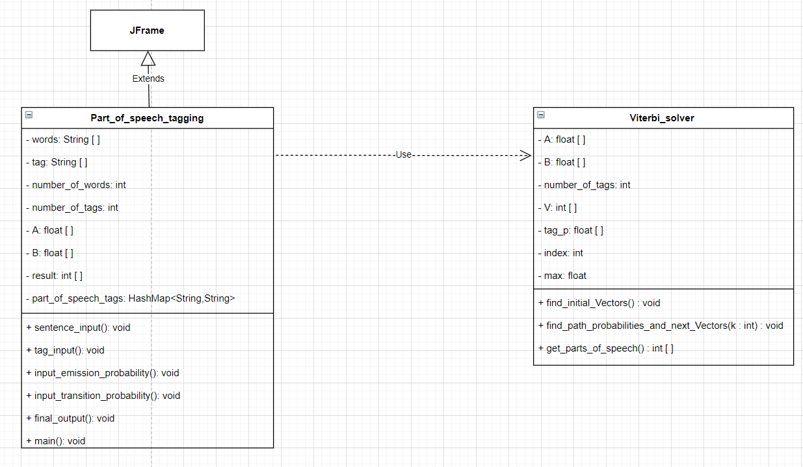
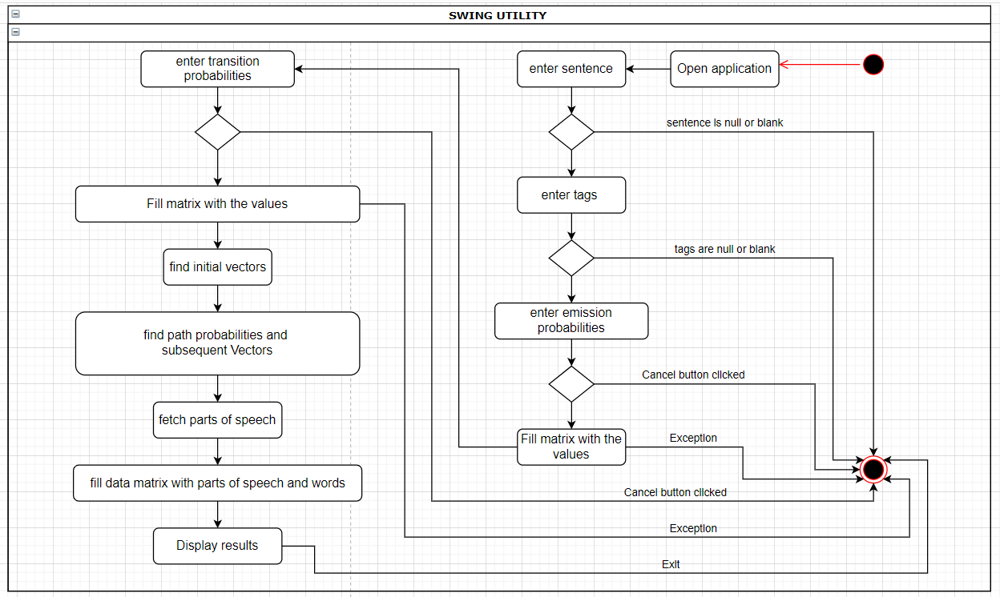
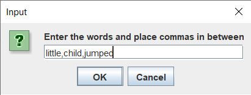
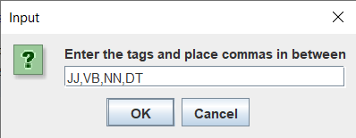
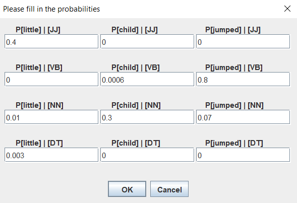
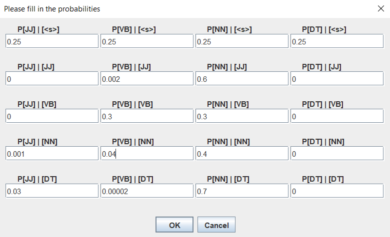
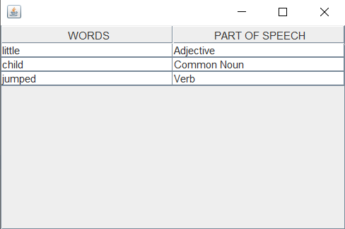

## Class diagram:

 

## Activity diagram:

 

## Processing starts, 

###first system asks for words of the sentence

###then for tags

###then word probabilties

###then tag probabilities

###then word distribution

