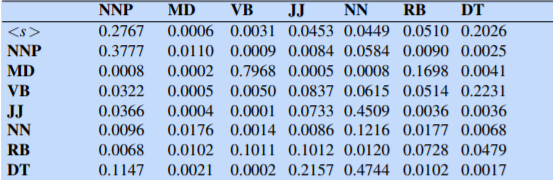
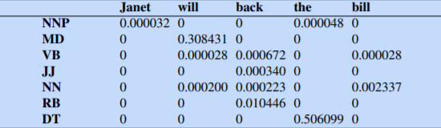
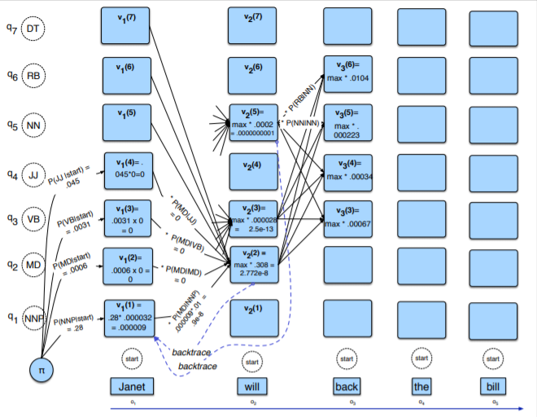

## Background:

Parts of speech (also known as POS) and named entities are useful clues to sentence structure and meaning. Knowing whether a word is a noun or a verb tells us about likely neighboring words (nouns in English are preceded by determiners and adjectives, verbs by nouns) and syntactic structure (verbs have dependency links to nouns), making part-of speech tagging a key aspect of parsing. 

Penn Treebank part-of-speech tags:

 

## Task: 

Part-of-speech tagging: mapping from input words x1, x2,..., xn to output POS tags y1, y2,..., yn 

### Using HMM Part-of-Speech Tagging:

A hidden Markov model (HMM) allows us to talk about both observed events hidden Markov model (like words that we see in the input) and hidden events (like part-of-speech tags) that we think of as causal factors in our probabilistic model. An HMM is specified by the following components:

 

### HMM Tagging as decoding:

For any model, such as an HMM, that contains hidden variables, the task of determining the hidden variables sequence corresponding to the sequence of observations decoding is called decoding. More formally,

Decoding: Given as input an HMM λ = (A,B) and a sequence of observations O = o1,o2,...,oT , find the most probable sequence of states Q = q1q2q3 ...qT.

 

### Viterbi algorithm which makes HMM tagging possible:

 

### Example:

sentence = Janet will back the bill

tags = NNP,MD,VB,JJ,NN,RB,DT

Transition probabilities computed from Wall Streeet Journal corpus:

Each a[i,j] represents the probability for transitioning between the hidden states (part-of-speech tags).

Observation likelihoods of words given tags:

Calculating viterbi values and path probabilities to find correct tags associated with the word: 

 

## Scope

I have tried to implement the above algorithm using Java. 

Inputs:

1. words of a sentence separated by commas
2. tags separated by commas
3. state likelihood probabilities or the probability that a word can be a noun or a pronoun
4. tag transition probabilites, meaning what is the probability that a verb will be followed by a noun or pronoun etc

Output:

Consists of table having 2 column, one is the "word" and another shows "POS tag" for that word

 

## Class diagram:

 

## Activity diagram:

 

## Output: 

First system asks for words of the sentence

 

Then for tags

 

Then word probabilties

 

Then tag probabilities

 

Then POS tag of each word as output

 

## Future changes: 

* I would like to display the viterbi or vector values.
* I would like to take a big paragraph input from a file and assign tags to it.
* I would like to do use a dictionary API to check if the word is relevant or is a slang which cannot be tagged
