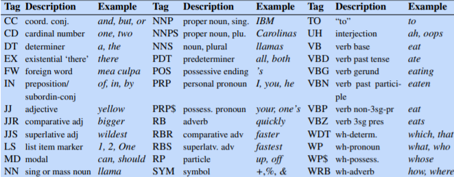
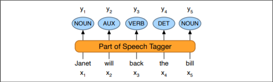
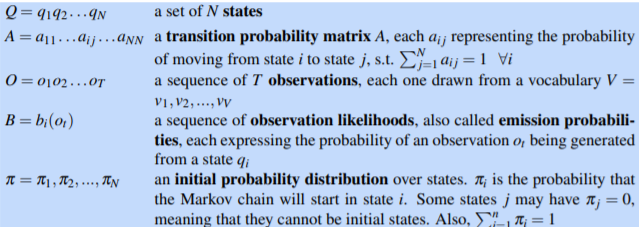
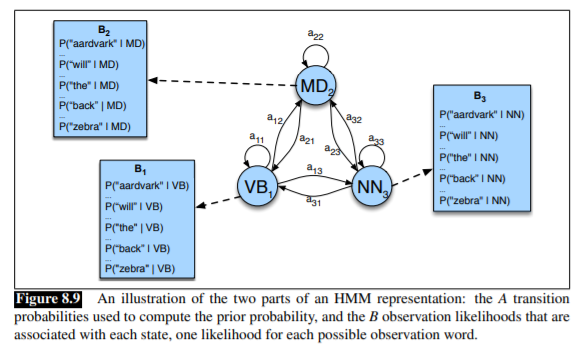
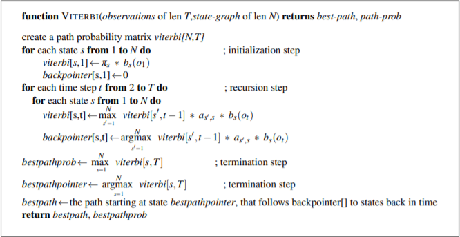
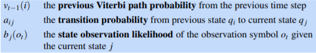

## Background:

Parts of speech (also known as POS) and named entities are useful clues to sentence structure and meaning. Knowing whether a word is a noun or a verb tells us about likely neighboring words (nouns in English are preceded by determiners and adjectives, verbs by nouns) and syntactic structure (verbs have dependency links to nouns), making part-of speech tagging a key aspect of parsing. Knowing if a named entity like Washington is a name of a person, a place, or a university is important to many natural language understanding tasks like question answering, stance detection, or information extraction.

Penn Treebank part-of-speech tags:

### Task: 

part-of-speech tagging: mapping from input words x1, x2,..., xn to output POS tags y1, y2,..., yn 

### Using HMM Part-of-Speech Tagging:

An HMM is a probabilistic sequence model: given a sequence of units (words, letters, morphemes, sentences, whatever), it computes a probability distribution over possible sequences of labels and chooses the best label sequence.

The HMM is based on augmenting the Markov chain. A Markov chain is a model that tells us something about the probabilities of sequences of random variables, states, each of which can take on values from some set. These sets can be words, or tags, or symbols representing anything, for example the weather. A Markov chain makes a very strong assumption that if we want to predict the future in the sequence, all that matters is the current state. All the states before the current state have no impact on the future except via the current state. I

A hidden Markov model (HMM) allows us to talk about both observed events hidden Markov model (like words that we see in the input) and hidden events (like part-of-speech tags) that we think of as causal factors in our probabilistic model. An HMM is specified by the following components:

### HMM Tagging as decoding:

For any model, such as an HMM, that contains hidden variables, the task of determining the hidden variables sequence corresponding to the sequence of observations decoding is called decoding. More formally,

Decoding: Given as input an HMM λ = (A,B) and a sequence of observations O = o1,o2,...,oT , find the most probable sequence of states Q = q1q2q3 ...qT.

### Viterbi algorithm which makes HMM tagging possible:

 

## Class diagram:

 

## Activity diagram:

 

## Processing starts, 

###first system asks for words of the sentence

 

###then for tags

 

###then word probabilties

 

###then tag probabilities

 

###then word distribution

